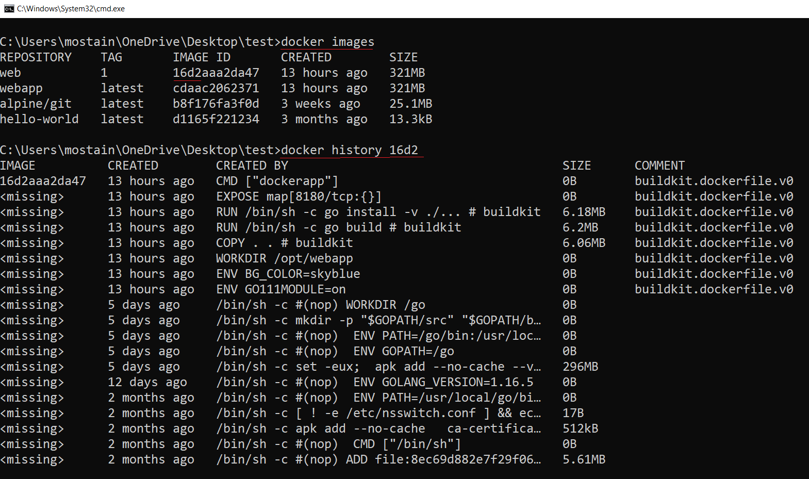
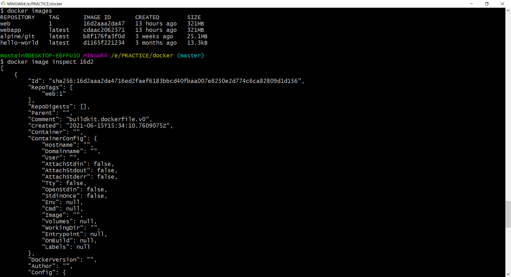
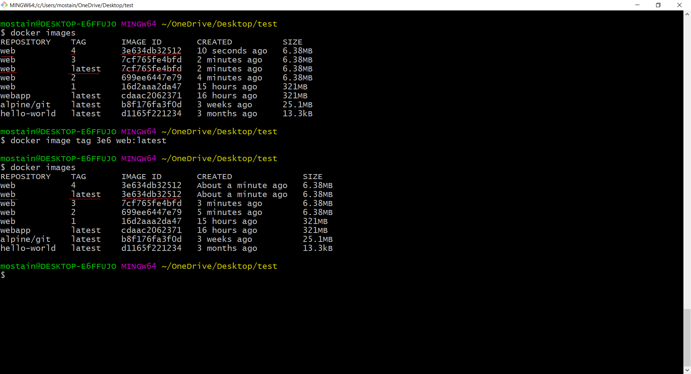
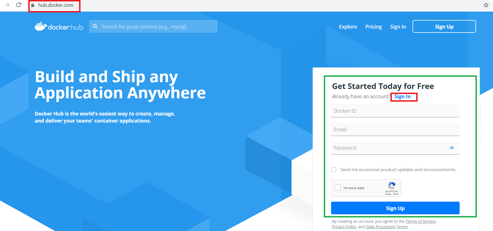
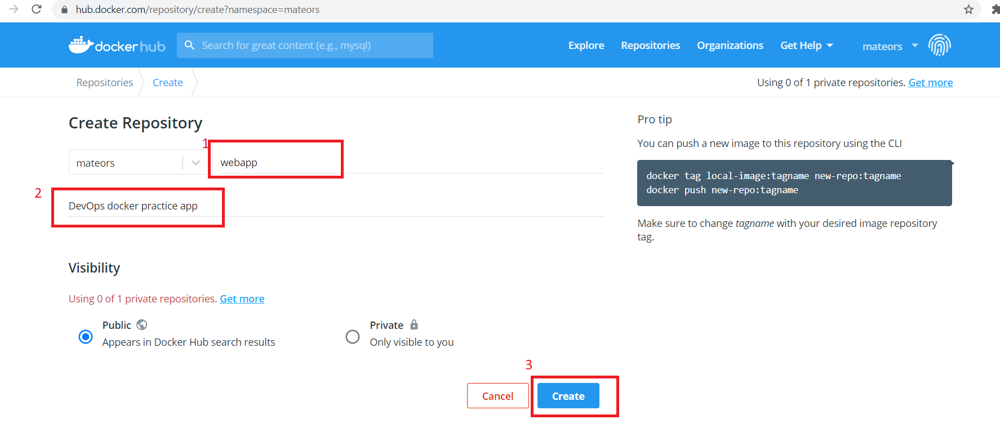
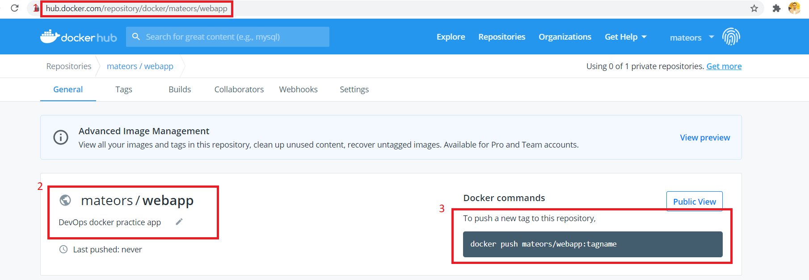

# Docker App Development & Command Practice

## What is Docker?
> A platform for building,running and shipping applications. in a consistent manner so if your application works on your development machine it can run and function the same way on other machine.

> **Container:** An isolated environment for running an application.

> **Container states** – A container can be in one of four states: created,running, paused, exited, restarting.

## Docker Image: 
> Docker images are The blueprints of our application which form the basis of containers. We use docker pull command to download an image.

* A standalone, executable package that can be run in a container.

* A Docker image is a binary that includes all of the requirements for running a single Docker container, as well as metadata describing its needs and capabilities.

* An image includes everything that is needed to run an application, including the application's executable code, any software on which the application depends, and any required configuration settings. You can build your own images (using a Dockerfile) or use images that have been built by others and then made available in a registry (such as Docker Hub).

* To build an image from a Dockerfile you use the docker build command.

* To run an image in a container you use the docker run command.


> **Containers** - Created from Docker images and run the actual application. After downloading the image We create a container using docker run command. A list of running containers can be seen using the docker ps command.

## Dockerfile:
> A text document containing the commands to build a Docker image.
> To build an image from a Dockerfile you use the docker build command.

### Example Dockerfile
```
    #comments
    FROM golang:alpine
    ENV GO111MODULE=on
    ENV BG_COLOR=skyblue
    WORKDIR /opt/webapp
    COPY . .
    RUN go build
    RUN go install -v ./...
    EXPOSE 8180
    CMD ["dockerapp"]
```

### We use docker build command to create container from above dockerfile
> Syntax: docker build <dockerFile> <option> <path>\
> `docker build .` repository=<none>, tage=<none>\
> `docker build . -t mateors/hello` repository=mateors/hello, tag=latest\
> `docker build . -t mateors/hello:1` repository=mateors/hello, tag=1\
> `docker build -f Dockerfile.dev -t helloWorld` repository=helloWorld, tag=latest\
> `docker build -f Dockerfile.dev -t helloWorld:1` repository=helloWorld, tag=1

### List Images
> there are two commands to show the image list
* docker images
* docker image ls

> `docker images --help`\
> `docker images`\
> `docker image ls`

### Image Build history (Show the history of an image)
> `docker history <imageName or ID>`\
> `docker image history <imageName or ID>`\


### Remove ALL unused images
> `docker image prune`

### Remove one or more unused images
> `docker image rm <imageName or ID>`\
> `docker image remove <imageName or ID>`\
> `docker image rmi <imageName or ID>`\
> `docker image rmi -f <imageName or ID>`\
> `docker image rmi <imageName or ID> <imageName or ID> <imageName or ID>`\


### Check build history (Show the history of an image)
> `docker history --help`\
> `docker history <imageName or ID>`

### Inspect - Display detailed information on one or more images
> `docker image inspect --help`\
> `docker image inspect <imageName or ID>`


### Tag - Tagging Images
* latest tag is just a label
* latest tag does not neccessarily mean it is the latest version of the image
* latest tag does not neccessarily reference the latest image
* Explicit tag to indentify what version you are running (`docker image tag <imageID> webapp:latest`)

> `docker build -t webapp .` clean build\
> `docker images` to display all of our images\
> `docker image tag`

### How can we tag an image?
> There are tow ways
* One way is tag an image while building it (`docker build -t webapp:2 .`)
* the other way after the build (`docker image tag webapp:latest webapp:1`)
> `docker image tag <imageID> webapp:latest`


> **Remove a tag**


> **Explicitely update a tag**cls


### How do we remove tag?
> `docker image remove webapp:2`

## docker push - Sharing Images
> **Login** to hub.docker.com (if not registered yet please signup)\


> **Navigate** to https://hub.docker.com/repositories\


> **Create a repository** like github\
\
> Repo confirmation window


> All possible commands are listed in the following google docs

## References
* [Docker docs](https://docs.google.com/document/d/1aXqP3HGMoaD-zOfmsQFjbuMB13LMNEVg1bZNuBtM-wM/edit?usp=sharing)

